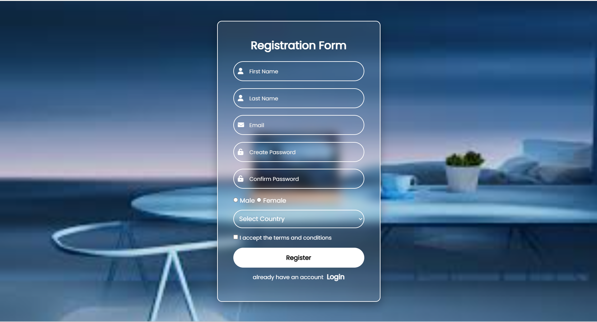

# Registration Form UI

A modern and responsive **Registration Form** built using **HTML5 and CSS3**, featuring a clean **glassmorphism design**, Font Awesome icons, and user-friendly form validation. This project is suitable for beginners learning frontend development and can be easily hosted using **GitHub Pages**.

## 🚀 Features
- Clean and modern glassmorphism UI
- Fully responsive layout
- Font Awesome icons for better UX
- HTML5 form validation
- Country selection dropdown
- Gender selection using radio buttons
- Terms and conditions checkbox
- Ready for GitHub Pages deployment

## 🛠️ Technologies Used
- **HTML5**
- **CSS3**
- **Font Awesome 6**
- **Google Fonts (Poppins)**

```
## 📂 Project Structure

registration_form/
│── index.html
│── registrationform.css
│── images/
│ └── laptop_special.jpg
│── screenshots/
│ └── registration.png
```
## 🖼️ Screenshots
### Registration Form UI


## 📌Notes
-This project focuses on frontend UI only.
-No backend or database is connected.
-Ensure correct relative paths for CSS and images when deploying.Future Emprovements ✨ 
-Add JavaScript form validation
-Add password strength indicator
-Backend integration (Node.js / PHP / Firebase)

Improve accessibility (ARIA labels)

## 📜 Screenshots
-This project is open-source and available under the MIT License.

👤 Author

-PROSPERITY (Takundah Gorogodo)
-Frontend Development Enthusiast
-GitHub: https://github.com/takundagorogodo
